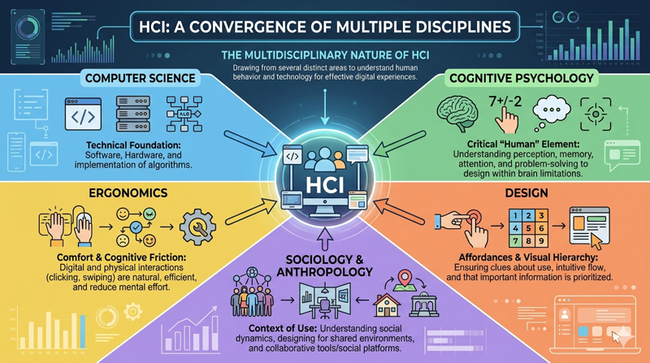

# Defining Human Computer Interaction

At its core, Human-Computer Interaction (HCI) is the study of how people interact with computers and to what extent computers are or are not developed for successful interaction with human beings. While a casual observer might mistake HCI for simple graphic design or user interface (UI) layout, it is a rigorous field that sits at the intersection of computer science, behavioral sciences, and design. For a web developer, understanding HCI is the difference between building a site that merely functions and building a site that empowers the user to achieve their goals with efficiency and satisfaction.

HCI is concerned with the entire "dialogue" between the user and the machine. This dialogue involves the input (how the user tells the computer what to do), the output (how the computer provides feedback), and the cognitive processes the user undergoes to bridge the gap between their mental goals and the physical interface.

## The Multidisciplinary Nature of HCI

HCI is inherently multidisciplinary because no single field can fully account for the complexity of human behavior or the rapid evolution of technology. To build effective digital experiences, we must draw from several distinct areas of study:



*   **Computer Science:** Provides the technical foundation. It involves the engineering of software, the capabilities of hardware, and the implementation of algorithms that make interaction possible.
*   **Cognitive Psychology:** This is perhaps the most critical "human" element. It helps us understand human perception, memory, attention, and problem-solving. By understanding the limitations of the human brain—such as how many items we can hold in short-term memory—developers can design interfaces that do not overwhelm the user.
*   **Design:** Beyond aesthetics, design in HCI focuses on "affordances" (clues about how an object should be used) and visual hierarchy. It ensures that the most important information is seen first and that the interface is intuitive.
*   **Sociology and Anthropology:** These fields help us understand the context of use. Computers are rarely used in a vacuum; they are used in offices, homes, and public spaces. Understanding social dynamics helps in designing collaborative tools and social media platforms.
*   **Ergonomics:** While often associated with physical chairs or keyboards, digital ergonomics involves reducing "cognitive friction" and ensuring that the physical interactions (like clicking or swiping) are comfortable and efficient.


## The Evolution of HCI: From Mainframes to the Modern Web

The history of HCI is a story of moving the burden of interaction from the human to the machine. In the early days of computing, humans had to learn the "language" of the computer. Today, we expect computers to understand our language and intent.

### The Era of Batch Processing and Command Lines
In the 1950s and 60s, interaction was indirect. Users wrote programs on punch cards and waited hours for a printout. As technology progressed to Command Line Interfaces (CLI), users had to memorize complex syntax and "codes." In this era, the "user" was almost always a highly trained specialist. The barrier to entry was high, and the human did most of the cognitive work.

### The GUI Revolution and Direct Manipulation
The late 1970s and 80s saw the birth of the Graphical User Interface (GUI), pioneered at Xerox PARC and popularized by Apple and Microsoft. This introduced the "WIMP" paradigm: Windows, Icons, Menus, and Pointers. This was a seismic shift toward "direct manipulation." Instead of typing a command to delete a file, a user could physically drag a folder icon to a trash can icon. This leveraged human spatial reasoning and recognition rather than rote memorization.

### The Modern Web and Ubiquitous Computing
The rise of the World Wide Web in the 1990s and the mobile revolution of the 2000s changed the landscape again. Interaction is no longer limited to a desktop. We now design for "ubiquitous computing," where the interface might be a 6-inch smartphone, a 27-inch monitor, or a voice-activated smart speaker. For web developers, this means moving away from static layouts toward responsive, fluid designs that prioritize accessibility and context.


```masteryls
{"id":"486c4755-b9cc-4cae-9f4c-87243777aea9", "title":"HCI Evolution and Focus", "type":"multiple-choice"}
How did the primary focus of Human-Computer Interaction (HCI) shift as it evolved from the era of early mainframe computing to the modern web and mobile era?

- [ ] From a focus on social psychology and group dynamics to a narrow technical focus on hardware processing speeds.
- [ ] From developing high-level programming languages for experts to focusing exclusively on the aesthetic visual design of hardware peripherals.
- [x] From optimizing machine efficiency and batch processing to enhancing user experience, accessibility, and the social context of use.
- [ ] From studying physical ergonomics in keyboard layouts to focusing solely on increasing the raw data throughput of network protocols.
```


## HCI in Web Development: Practical Examples

In web development, HCI principles manifest in every decision you make. Consider the difference between a standard HTML `<button>` and a div styled to look like a button. A native button provides built-in HCI benefits: it is keyboard-accessible by default, it provides visual feedback when pressed, and it signals its purpose to screen readers.

**Example: The Checkout Experience**
Imagine a user trying to purchase a product.
*   **Bad HCI:** A single, massive form with 20 fields, no validation until the "Submit" button is clicked, and a "Clear Form" button placed right next to "Submit."
*   **Good HCI:** A multi-step process (reducing cognitive load), real-time validation (providing immediate feedback), and a clear visual hierarchy that emphasizes the "Continue" action while de-emphasizing "Cancel."


By applying HCI, you transition from being a coder who "makes things work" to a developer who "makes things usable."

## Common Challenges and Strategic Solutions

One of the greatest challenges in HCI is the **"Designer's Blindness."** As the creator of an application, you know exactly how it works. This makes it impossible for you to see the interface with the "fresh eyes" of a first-time user.

*   **The Challenge:** Feature Creep. Adding too many features can clutter the interface, making it difficult for users to find the core functionality.
*   **The Solution:** Use User-Centered Design (UCD). Regularly test your site with real users who have no prior knowledge of the project. Observe where they click, where they hesitate, and where they fail.

*   **The Challenge:** Designing for the "Average" User. There is no such thing as an average user. Users have different physical abilities, varying levels of technical literacy, and different cultural backgrounds.
*   **The Solution:** Prioritize Accessibility (A11y). Use semantic HTML, ensure high color contrast, and provide text alternatives for non-text content. HCI teaches us that an accessible design is a better design for everyone.


## Engaging with the Material

As you move through this course, stop and observe the websites you use daily. Ask yourself:
1.  Does this site help me achieve my goal, or does it get in my way?
2.  When I click a button, how do I know the "system" has received my request?
3.  Are the labels on this navigation menu clear, or do they use "insider" jargon that I don't understand?

Thoughtful engagement with these questions will help you internalize the principles of HCI before you even write your first line of CSS for a project.


```masteryls
{"id":"678b68b0-a17f-4862-b805-d76e3af331c9", "title":"Strategic Benefits of HCI Knowledge", "type":"multiple-choice"}
How does understanding the multidisciplinary evolution of Human-Computer Interaction (HCI) benefit a professional developing for the modern web era?

- [ ] It allows developers to focus exclusively on hardware optimization by applying principles from the early era of mainframe computing.
- [x] It enables the creation of systems that align with human cognitive limitations and social behaviors, leading to higher user adoption and fewer errors.
- [ ] It provides a set of rigid aesthetic rules that prioritize visual artistic expression over the functional requirements of the software.
- [ ] It ensures that web applications are restricted to legacy interface patterns to maintain consistency with 1980s command-line standards.
```


## External Resources for Further Exploration

To deepen your understanding of the foundational principles of HCI, the following resources are highly recommended:
*   **The Nielsen Norman Group (nngroup.com):** A leading resource for evidence-based user experience research.
*   **The Interaction Design Foundation:** Offers comprehensive articles on the history and theories of HCI.
*   **W3C Web Accessibility Initiative (WAI):** The gold standard for learning how to make the web accessible to all humans.

## Summary

Human-Computer Interaction is a multidisciplinary field that seeks to optimize the relationship between people and technology. It has evolved from the rigid, specialist-driven systems of the mid-20th century to the intuitive, ubiquitous web experiences of today. For the modern web developer, HCI is not an "extra" feature—it is the framework through which all development should occur. By understanding the psychological and social needs of users, and by acknowledging the technical constraints of the medium, you can create web applications that are not only functional but also inclusive, efficient, and enjoyable to use.