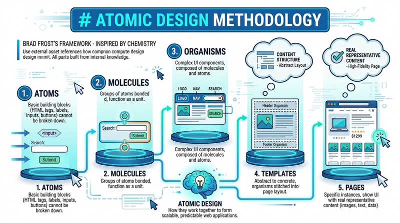

# Design Systems and Component Libraries

In the early days of the web, designing a website often felt like building a unique piece of furniture from scratch every time. Designers would hand-draw layouts, and developers would write custom CSS for every button, header, and form field. However, as web applications have grown into massive, multi-platform ecosystems, this "bespoke" approach has become unsustainable. Modern web development requires a "single source of truth" to ensure that a brand’s identity remains consistent whether a user is viewing a dashboard on a desktop or a settings page on a mobile app. 

A design system is that source of truth. It is not merely a collection of UI elements or a style guide; it is a comprehensive ecosystem of design standards, documentation, and code snippets that allow teams to build better products faster. By moving away from individual page designs toward a system of reusable components, organizations can reduce "design debt" and focus on solving complex user experience problems rather than arguing over the border radius of a button.

## The Anatomy of a Design System

To understand how a design system functions, it is helpful to distinguish between its various layers. While many people use the terms "style guide" and "design system" interchangeably, they represent different levels of maturity.

A **Style Guide** focuses on the visual identity of a brand—colors, typography, logos, and brand voice. A **Component Library** is the technical implementation of that style guide, consisting of reusable code snippets (usually in frameworks like React, Vue, or standard CSS/HTML) that developers can drop into a project. A true **Design System** encompasses both of these, along with a set of shared values, governance models, and documentation that explains not just *what* a component looks like, but *why* and *how* it should be used.

### Design Tokens: The Smallest Units
At the most granular level, design systems utilize "Design Tokens." These are names used to express design decisions in a platform-agnostic way. Instead of hard-coding a hex value like `#007bff` across a codebase, a developer uses a token like `color-primary-action`. If the brand decides to change its primary blue to a different shade, the team only needs to update the value in one place, and it propagates across the entire ecosystem.


By centralizing values like colors, typography, and spacing into a structured format (typically JSON), large-scale projects can maintain visual consistency across different platforms (Web, iOS, Android) and update global styles instantly from a single file.

#### 1. Token Definition (JSON)
This format serves as the "source of truth." It is easily exported from design tools and can be transformed into various code formats.

```json
{
  "color": {
    "brand": {
      "primary": { "value": "#0052CC", "type": "color" },
      "secondary": { "value": "#0747A6", "type": "color" }
    },
    "status": {
      "success": { "value": "#36B37E", "type": "color" },
      "error": { "value": "#FF5630", "type": "color" }
    }
  },
  "spacing": {
    "xs": { "value": "4px", "type": "dimension" },
    "md": { "value": "16px", "type": "dimension" },
    "xl": { "value": "32px", "type": "dimension" }
  },
  "font": {
    "size": {
      "base": { "value": "16px", "type": "dimension" },
      "h1": { "value": "32px", "type": "dimension" }
    }
  }
}
```

#### 2. Implementation (CSS Custom Properties)
In a web project, the JSON tokens are transformed into CSS variables. This ensures that developers use standardized values rather than arbitrary "magic numbers," significantly increasing efficiency and reducing technical debt.

```css
/* Automatically generated from design tokens */
:root {
  --color-brand-primary: #0052CC;
  --color-status-success: #36B37E;
  --spacing-md: 16px;
  --font-size-h1: 32px;
}

/* Application of tokens in components */
.alert-success {
  background-color: var(--color-status-success);
  padding: var(--spacing-md);
  border-radius: var(--spacing-xs);
}

.main-heading {
  color: var(--color-brand-primary);
  font-size: var(--font-size-h1);
  margin-bottom: var(--spacing-xl);
}
```


## Atomic Design Methodology

One of the most influential frameworks for building these systems was introduced by designer Brad Frost, known as Atomic Design. Drawing inspiration from chemistry, Frost suggests that interfaces can be broken down into five distinct levels:

*   **Atoms:** These are the basic building blocks of the web, such as an HTML tag, a label, an input, or a button. They cannot be broken down further without losing their functionality.
*   **Molecules:** These are groups of atoms bonded together to function as a unit. For example, a search label, an input field, and a "Submit" button combined form a search molecule.
*   **Organisms:** These are complex UI components composed of groups of molecules and/or atoms. A header organism might include a logo atom, a primary navigation molecule, and a search molecule.
*   **Templates:** At this stage, we move from the abstract to the concrete. Templates consist of organisms stitched together to form a page layout, focusing on the underlying content structure rather than final high-fidelity content.
*   **Pages:** These are specific instances of templates that show what the UI looks like with real representative content (images, text, and data) in place.



By thinking in atoms and molecules, designers and developers can ensure that the "Search" button in the header is the exact same component as the "Search" button in the footer, ensuring a predictable user experience.

Atomic design reinforces the software engineering practice of reusable modular design. The creates continuity and decreases the cognitive load of the user.

## HCI Principles and the Power of Consistency

The shift toward design systems is deeply rooted in Human-Computer Interaction (HCI) principles. One of the most famous guidelines is **Jakob’s Law**, which states that users spend most of their time on *other* sites. This means users prefer your site to work the same way as all the other sites they already know.

> "Users spend most of their time on *other* sites."
>
> _Jacob's Law_

When a design system is applied correctly, it reinforces a user's **mental model**. If every "Cancel" button in your application is gray and every "Confirm" button is green, the user learns this pattern quickly. This reduces **cognitive load**—the amount of mental effort required to use the interface. If a user has to stop and think, "Is this button going to delete my data or save it?" because the styling is inconsistent, the design has failed. Design systems automate the "easy" decisions (like color and spacing) so that the user can focus on the "hard" tasks (like completing a complex workflow).

## Practical Benefits in the Development Workflow

For undergraduate developers, the most immediate benefit of a component library is the speed of implementation. When using a library like IBM’s *Carbon* or Shopify’s *Polaris*, you do not need to write CSS for a modal window or a data table. You simply import the component and pass it the necessary data.

This approach also significantly improves **Web Accessibility (WCAG)**. Building a truly accessible dropdown menu or date picker is notoriously difficult. In a design system, accessibility experts can build the "Gold Standard" version of a component once—including correct ARIA labels, keyboard navigation, and focus management—and every developer who uses that component automatically benefits from those accessibility features.

## Common Challenges and Solutions

Despite their benefits, design systems are not a "set it and forget it" solution. They require constant maintenance and face several common hurdles:

*   **The Rigidity Trap:** A design system that is too strict can stifle innovation. If a designer needs a specific layout for a unique marketing campaign that isn't in the system, they may feel forced to create a "one-off" that breaks consistency. 
    *   *Solution:* Build flexibility into components using "slots" or "props" that allow for variations while keeping the core DNA intact.
*   **Adoption and Governance:** The best design system in the world is useless if no one uses it. Developers might find it easier to write their own CSS than to learn the system's API.
    *   *Solution:* Create clear documentation and a "contribution model" where developers can suggest improvements or new components to the system.
*   **Design System Debt:** As technology evolves, components can become outdated.
    *   *Solution:* Treat the design system as a product itself, with its own roadmap, versioning (e.g., using Semantic Versioning like v1.0.0), and dedicated maintenance team.

## Real-World Examples

To see these principles in action, you can explore the public documentation of industry-leading design systems:

*   **Material Design (Google):** One of the most comprehensive systems, focusing on tactile surfaces and bold typography.
*   **Human Interface Guidelines (Apple):** The gold standard for platform-specific consistency within the Apple ecosystem.
*   **Lightning Design System (Salesforce):** A great example of a system designed for massive, data-heavy enterprise applications.
*   **Atlassian Design System:** Excellent documentation on how to balance brand personality with functional utility.

## Summary

Design systems and component libraries represent the maturation of web design from a craft into an engineering discipline. By breaking interfaces down into reusable, documented units—from design tokens to organisms—teams can ensure that their products are consistent, accessible, and scalable. For the modern web developer, mastering these systems is not just about writing better CSS; it is about understanding how to build a cohesive language that allows users to interact with technology intuitively and efficiently. As you build your projects, ask yourself: "Am I designing a page, or am I designing a system?" The answer will define the longevity and usability of your work.