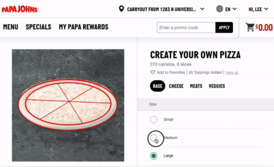

# Designing Effective Web Forms

Forms are the bridge between a user’s intent and a system’s action. Whether a user is signing up for a newsletter, completing a high-stakes financial transaction, or simply searching for a product, the web form is the primary interface for data entry and interaction. In the context of Human-Computer Interaction (HCI), forms represent a conversation. If the form is poorly designed, the conversation feels like an interrogation; if it is well-designed, it feels like a helpful guide.

Understanding form design requires moving beyond simple HTML tags. It requires an appreciation for cognitive load, visual hierarchy, and the mental models users bring to the screen. As we explore the mechanics of effective forms, we will apply foundational principles like Hick’s Law—which suggests that the time it takes to make a decision increases with the number and complexity of choices—and Fitts’s Law, which informs how we size and position our interactive elements.

### The Psychology of Form Completion

Before a user types a single character, they perform a "cost-benefit analysis." They subconsciously weigh the effort required to fill out the form against the value they expect to receive. This is known as the **interaction cost**. To minimize this cost, designers must respect the user's cognitive resources.

One of the most significant hurdles in form design is **form fatigue**. This occurs when a user is presented with too many fields or a confusing layout, leading to abandonment. To combat this, we follow the principle of "Less is More". Every field you remove increases the likelihood of completion. If a piece of data is not strictly necessary for the immediate transaction, it should be omitted or made optional.

### Label Placement and Scanning Patterns

How we label our inputs dictates how quickly a user can process the form. Research by usability experts like Luke Wroblewski has shown that the placement of labels significantly impacts completion time and eye-tracking patterns.

**Top-Aligned Labels** are generally considered the gold standard for standard web forms. When a label is placed directly above the input field, the user’s eyes move in a vertical line. This minimizes the number of "fixations" (eye stops), allowing for the fastest completion time. This layout also adapts beautifully to mobile screens.

**Left-Aligned Labels** are useful when the data being requested is unfamiliar or requires careful consideration. Because the user’s eyes must move horizontally from the label to the field, it slows down the scanning process. This "speed bump" can be beneficial for complex data entry where accuracy is more important than speed, such as in professional accounting software or medical records.

**Floating Labels**, which sit inside the field and move to the top when the user clicks, have become popular in modern UI frameworks. However, they can pose accessibility challenges. They often lack sufficient contrast and can disappear or become too small to read once the user starts typing, potentially causing the user to lose context of what they were entering.

### Selecting the Right Input Types

Choosing the correct input type is not just about functionality; it is about providing the right affordances. An affordance is a visual cue that tells the user how an object should be used.

For categorical choices, the decision between radio buttons and dropdown menus is a classic design dilemma. As a general rule, if there are fewer than five options, use **radio buttons**. Radio buttons allow the user to see all available choices at once, reducing the cognitive effort required to remember the options. **Dropdown menus** should be reserved for long lists, such as a list of countries or states, where showing all options would clutter the interface.

For binary choices (Yes/No), **checkboxes** are the standard. However, ensure that the label clearly describes what happens when the box is checked. Avoid "double negatives," such as a checkbox labeled "Do not unsubscribe," as these force the user to perform extra mental gymnastics to understand the outcome.


```masteryls
{"id":"99ee259a-9690-40c7-8e3c-c9526baa0255", "title":"Selecting the Optimal Input Type", "type":"multiple-choice"}
When designing a form where a user must select exactly one option from a list of three mutually exclusive choices (e.g., "Small," "Medium," or "Large"), which input type provides the best usability by minimizing cognitive load and interaction cost?

- [ ] A dropdown menu (select box) to keep the interface clean and save vertical space
- [x] Radio buttons, because they allow the user to see all available options immediately and select one with a single click
- [ ] Checkboxes, as they are the standard convention for selecting items from a short list
- [ ] A toggle switch, because it provides an immediate visual confirmation of the selection state
```


### Error Handling and Inline Validation

Nothing frustrates a user more than hitting "Submit" only to be told they made a mistake three screens ago. Effective forms use **inline validation** to provide real-time feedback.

When a user moves from one field to the next (the `onBlur` event in development terms), the system should check if the data is valid. If it is, a subtle green checkmark can provide positive reinforcement. If there is an error, the message should appear immediately near the relevant field. 

Effective error messages follow three rules:
1.  **Be Clear:** Tell the user exactly what went wrong (e.g., "Password must include a number" instead of "Invalid input").
2.  **Be Helpful:** Tell them how to fix it.
3.  **Be Polite:** Avoid using "shouting" capital letters or aggressive red tones that make the user feel at fault.

From an accessibility standpoint (WCAG), errors must not be communicated by color alone. Use icons and descriptive text to ensure users with color blindness can identify and correct issues.

### Structuring Long Forms with Multi-Step Progression

When a form requires a significant amount of information—such as a mortgage application or a detailed user profile—presenting all fields on a single page can be overwhelming. This is where **chunking** and multi-step progression come into play.

By breaking a long form into logical sections, you reduce the perceived complexity. Each step should represent a clear "chapter" in the process (e.g., Personal Info, Shipping Details, Payment). 

To make multi-step forms successful:
*   **Provide a Progress Indicator:** Users need to know where they are and how much is left. A progress bar or a "Step 1 of 4" label manages expectations and reduces anxiety. Displaying the progression of the desired outcome can be even more powerful. For example, the creation of the pizza you are purchasing.
*   **Save Progress Automatically:** If a user accidentally closes their browser, losing their data is a guaranteed way to ensure they never return.
*   **Allow Backtracking:** Ensure users can go back to previous steps to review or edit their information without losing the data they’ve already entered.
*   **Break into logical groups:** Most tasks have logical groupings. By restricting the choices to be specific to each group you can make a complex process feel easier. This reduces the cognitive load in accordance with Hicks's Law. 



### Common Challenges and Real-World Solutions

One frequent challenge is the "Address Paradox." Asking for a street address, city, state, and zip code involves many fields. A modern solution is to use an **address autocomplete** API. As the user starts typing their street address, the system suggests verified addresses. Selecting one populates the remaining fields automatically, reducing typing effort and ensuring data accuracy.

Another challenge is the mobile context. On mobile devices, screen real estate is limited, and typing is difficult. To solve this, designers should use specialized input types. For example, using `<input type="tel">` triggers the numeric keypad on a smartphone, while `<input type="email">` brings up a keyboard with the "@" symbol prominently displayed. These small technical choices significantly improve the user experience by matching the interface to the user’s physical constraints.

### Summary

Designing effective web forms is an exercise in empathy and efficiency. By prioritizing top-aligned labels for speed, choosing the right input types to provide clear affordances, and implementing helpful inline validation, we create a seamless experience for the user. Remember that a form is a dialogue; our goal is to make that dialogue as clear, concise, and error-free as possible. As you move forward in your design journey, always ask: "Is this field necessary, and is this the easiest way for the user to provide this information?" 

### External Resources for Further Study

*   **"Web Form Design: Filling in the Blanks" by Luke Wroblewski:** The definitive text on form usability and layout.
*   **Nielsen Norman Group (NN/g):** Search their articles for "Form UX" to find deep dives into specific patterns like "Select-All" checkboxes and "Stepper" inputs.
*   **The A11Y Project:** A community-driven resource to make digital accessibility easier, featuring checklists for accessible form components.