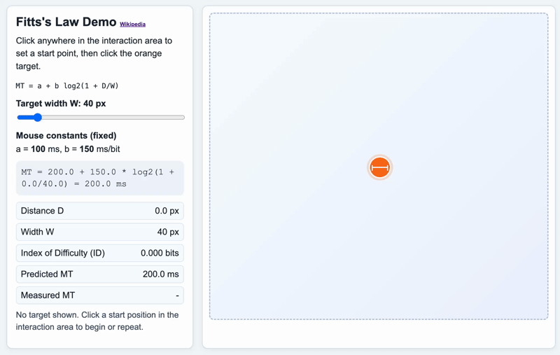

# Fittss Law and Interaction Speed

In the realm of Human-Computer Interaction (HCI), we often search for ways to quantify the user experience. While "good design" can sometimes feel subjective, Fitts’s Law provides a robust, mathematical foundation for understanding how humans interact with physical and digital interfaces. Named after psychologist Paul Fitts, who first proposed it in 1954, this law predicts the time required to move to a target area based on the distance to the target and the size of the target itself.

For web developers and designers, Fitts’s Law is more than just a psychological theory; it is a practical tool for optimizing layout, improving navigation speed, and reducing user frustration. By understanding the relationship between movement and accuracy, we can create interfaces that feel "snappy" and intuitive rather than cumbersome.

## The Mathematical Foundation



[Experiment with Fitts's Law](/course/ede2e6ad-1b55-4ddb-8d4b-e04beff16b9f/topic/8729c03c-c27c-40cb-87b3-057f0ae217de)

At its core, Fitts’s Law states that the time to acquire a target is a function of the distance to and the size of the target. The formula is traditionally expressed as:

**MT = a + b log₂(1 + D/W)**

In this equation:
*   **MT** is the Movement Time (the time it takes to complete the action).
*   **a** and **b** are constants that represent the specific device or environment (like using a mouse versus a touch screen).
*   **D** is the Distance from the starting point to the center of the target.
*   **W** is the Width of the target measured along the axis of motion.

The term **log₂(1 + D/W)** is often called the **Index of Difficulty (ID)**. Essentially, as the distance increases, the difficulty goes up. As the width of the target increases, the difficulty goes down. This confirms a common-sense intuition: it is much faster to click a large button right next to your cursor than it is to click a tiny icon on the opposite side of the screen.

## The Principle of Diminishing Returns

One of the most important takeaways from Fitts’s Law is the logarithmic nature of the relationship. This means that increasing the size of a very small button provides a massive boost in usability, but increasing the size of an already large button provides only a marginal benefit.

For example, if you have a 5-pixel button, doubling it to 10 pixels significantly reduces the time it takes for a user to click it. However, if you have a 500-pixel button, doubling it to 1000 pixels will barely be noticeable to the user in terms of interaction speed. As a designer, your goal is to find the "sweet spot" where targets are large enough to be easily captured without wasting valuable screen real estate.

## Practical Applications in Web Design

Applying Fitts’s Law to web development involves strategic decisions regarding the size and placement of interactive elements.

### Target Size and the "Hit Area"
The "hit area" of a button is often more important than its visual representation. In modern CSS, we can use padding to increase the clickable area of a link or button without necessarily making the text or icon larger. This is especially critical for mobile users. Apple’s Human Interface Guidelines and Google’s Material Design both suggest a minimum target size (roughly 44x44 pixels or 48x48 pixels) to accommodate the average human fingertip.

### Reducing Travel Distance
Distance is the other half of the equation. If a user is filling out a long form, the "Submit" button should be located directly beneath the final input field, not at the top of the page or tucked away in a sidebar. By placing the next logical action close to where the user’s cursor (or finger) already is, you minimize the "D" in the formula and speed up the interaction.

### The Magic of the Corners and Edges
In desktop environments, the edges and corners of the screen are unique because they represent "infinitely large" targets. Since the mouse cursor stops at the edge of the screen regardless of how much further the user moves the mouse, the width (W) of a target pinned to an edge is effectively infinite in that direction. 

This is why the Windows "Start" button and the Apple menu are located in the corners. A user can throw their mouse toward the corner with very little precision and still successfully hit the target. When designing web applications that run in full-screen mode, placing frequently used global navigation at the very top or bottom of the viewport can leverage this effect.

## Interaction Design Challenges

While Fitts’s Law seems straightforward, designers often face challenges when balancing usability with aesthetics or complex functionality.

### The "Fat Finger" Problem
On mobile devices, users do not have the precision of a pixel-perfect mouse cursor. Because the finger obscures the target, the "W" in our formula becomes more volatile. If targets are too close together, the user may accidentally trigger the wrong action. This is a common violation of Fitts’s Law: placing two small, high-stakes buttons (like "Save" and "Delete") immediately adjacent to one another.

### Pop-up Menus and Hover States
Contextual menus (right-click menus) are a classic application of Fitts’s Law because they appear exactly where the cursor is, making the distance (D) zero. However, cascading sub-menus can create "steering" problems. If a sub-menu requires a user to move their mouse in a very specific, narrow horizontal path, the "Width" of that path is so small that the Index of Difficulty skyrockets. Modern UI solutions often use a small "buffer" or delay to ensure that the menu doesn't disappear if the user's movement isn't perfectly linear.

## Thoughtful Engagement: Analyzing Your Workflow

To better understand these concepts, consider the software you use daily. Open a web browser or a mobile app and ask yourself the following:
1.  Where is the most important button on the screen? How large is it compared to less important buttons?
2.  How far does your cursor have to travel to navigate between the main content and the primary menu?
3.  Have you ever missed a button because it was too small? Was it a "floating" button, or was it tucked into a corner?

By observing these interactions, you will begin to see Fitts’s Law in action everywhere, from the giant "Order Now" buttons on e-commerce sites to the tiny "X" icons on intrusive advertisements (which purposefully violate Fitts's Law to make them harder to click).


```masteryls
{"id":"83e5b8de-57cd-44ac-b066-f7f930244221", "title":"Challenges to Fitts's Law Application", "type":"multiple-choice"}
Fitts's Law predicts the time required to move to a target based on the target's size and its distance from the starting point. Which of the following web design factors most directly frustrates this law by making the "distance" and "size" variables unpredictable for the user?

- [ ] The use of a minimalist aesthetic that reduces the number of visual cues on the page
- [x] Dynamic layout shifts that move an element's position while the user is in the process of pointing
- [ ] Choosing a color palette with low contrast between the button text and its background
- [ ] Implementing a responsive design that changes the layout based on the device's screen orientation
```


## Summary

Fitts’s Law provides a scientific lens through which we can evaluate the efficiency of our user interfaces. By remembering that movement time is a balance of distance and size, we can make informed decisions that directly impact user productivity and satisfaction.

*   **Make important targets larger** to reduce the time needed to acquire them, but be mindful of the point of diminishing returns.
*   **Minimize the distance** between related interactive elements to create a more fluid user flow.
*   **Utilize screen boundaries** in desktop design to create targets that are easy to hit with low precision.
*   **Prioritize touch-friendly dimensions** for mobile interfaces to account for the lack of precision inherent in finger-based navigation.

Mastering Fitts’s Law allows you to move beyond "making things look good" and toward "making things work well," ensuring that your designs respect the physical and cognitive limits of your users.

***

### External Resources for Further Exploration
*   *The Design of Everyday Things* by Don Norman – A foundational text on HCI.
*   *Laws of UX* (lawsofux.com) – A visual guide to the psychology behind UI design.
*   *Nielsen Norman Group* – Articles on Fitts's Law and its application to modern web usability.