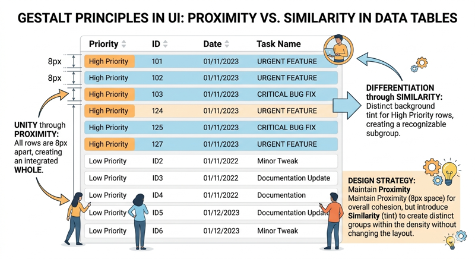

# Gestalt Principles in UI Design

When we look at a webpage, our brains do not perceive a chaotic collection of individual pixels, hex codes, and isolated strings of text. Instead, we instantly organize these elements into meaningful groups, patterns, and structures. This automatic mental processing is governed by the Gestalt Principles—a set of psychological theories developed by German psychologists in the early 20th century. In the context of Human-Computer Interaction (HCI), these principles are essential tools that allow designers to predict how users will interpret visual interfaces, ensuring that the intended message and functionality are conveyed with minimal cognitive effort.

The word *Gestalt* roughly translates to "form" or "shape" in German. The core philosophy is often summarized by the phrase: "The whole is other than the sum of its parts." For a UI designer, this means that the relationship between elements is often more important than the elements themselves. By understanding how the human eye naturally groups objects, we can create layouts that feel intuitive, reduce "visual noise," and guide the user toward their goals.


[Experiment with Gestalt](/course/ede2e6ad-1b55-4ddb-8d4b-e04beff16b9f/topic/f0bfc010-5a29-4717-b8f8-285f39952895)

## The Principle of Proximity

Proximity is perhaps the most powerful Gestalt principle in web design. It states that objects that are close to each other are perceived as a related group, while objects that are far apart are seen as independent.

In UI design, proximity is used to create logical relationships without the need for borders or lines. For example, in a standard web form, the label for a text field should be placed closer to its corresponding input box than to the label above it. If the spacing is equidistant, the user may become confused about which label belongs to which field, increasing the cognitive load required to complete the task. Effective use of white space—or "negative space"—is essentially the intentional application of proximity to define the boundaries of content modules.

## The Principle of Similarity

The principle of similarity suggests that our brains group elements together if they share similar visual characteristics, such as color, shape, size, or orientation. 

Consider a navigation menu. If all the links are styled with the same font, color, and weight, the user immediately recognizes them as having a similar function. Conversely, if one link is styled as a bright blue button while the others are simple black text, the principle of similarity is broken to create "anomaly." This anomaly draws the user’s eye, which is why we use distinct styling for Primary Call-to-Action (CTA) buttons. Designers must be careful, however; if elements with different functions look too similar, users may misinterpret their purpose, leading to "false affordances."


## The Principle of Continuity

Continuity occurs when the eye is compelled to move through one object and continue to another. Our brains prefer to follow continuous paths rather than abrupt changes in direction. 

In modern web interfaces, continuity is often used in carousels or horizontal scrolling lists. When a user sees a card or image that is partially cut off at the edge of the screen, the principle of continuity suggests that there is more content to be discovered. The brain follows the line of the content, prompting the user to swipe or scroll. Continuity is also achieved through the alignment of text and imagery; a clean vertical axis of alignment helps the user's eye "flow" down a page smoothly.

## The Principle of Closure

Closure refers to the brain's tendency to perceive a complete image even when parts of it are missing. We naturally fill in the gaps to create a whole.

This principle is frequently applied in iconography and logo design. For instance, the World Wildlife Fund (WWF) panda logo consists of several disconnected black shapes, yet we instantly perceive a complete panda. In UI design, closure allows us to simplify interfaces. We can use "ghost" buttons or minimalist icons that only outline a shape, trusting that the user’s mind will complete the form. It also plays a role in "progressive disclosure," where we show just enough information to imply a larger system, preventing the user from feeling overwhelmed by too much data at once.

## The Principle of Figure-Ground

The figure-ground principle describes the eye’s ability to separate objects (the figure) from their surrounding background (the ground). This is the fundamental basis of focal points.

In a web interface, we use this principle to manage the user’s attention. When a modal pop-up appears, the background is often darkened or blurred. This visual cue tells the brain that the background is now the "ground" and the modal is the "figure," effectively demanding the user’s immediate focus. A common mistake in design is creating a "busy" background that competes with the foreground text, making it difficult for the user to distinguish the figure from the ground, which leads to poor readability and eye strain.

## Common Challenges and Solutions

Although Gestalt can solve many problems by leveraging the minds natural pattern matching and grouping, it can also introduce new problems.

### Conflict of Principles

One of the most frequent challenges in applying Gestalt principles is the "Conflict of Principles." For example, you might place elements close together (Proximity) to show they are related, but give them vastly different colors (Similarity). This creates visual confusion. To solve this, designers must establish a visual hierarchy where one principle reinforces another rather than contradicting it.

```masteryls
{"id":"c9ea6d89-0714-4e5a-9f6e-c875a01baa13", "title":"Balancing Proximity and Similarity", "type":"multiple-choice"}
A designer is creating a dense data table where all rows are spaced exactly 8px apart, creating a strong sense of unity through proximity. To help users quickly distinguish between "High Priority" and "Low Priority" rows without changing the table's layout or spacing, the designer applies a distinct background tint to all High Priority rows.

Which statement best describes how Gestalt principles are being balanced in this design?

- [ ] Proximity is used to break the similarity of the rows, ensuring that the user treats each row as an individual data point.
- [x] Similarity is used to create functional sub-groups within a larger set that is already unified by proximity.
- [ ] Continuity is used to override proximity, directing the user's eye to read the High Priority rows as a single continuous path.
- [ ] Similarity is used to eliminate the effect of proximity, making the rows appear as if they are physically separated into two different tables.
```

### Accessibility

Another challenge is accessibility. While Gestalt principles help sighted users perceive groups, these relationships must also be conveyed to users with visual impairments. A designer should never rely solely on visual grouping (like proximity) to imply a relationship. The underlying HTML structure (using semantic tags like `<fieldset>` or `<ul>`) ensures that the "Gestalt" of the page is also understood by screen readers.


## Thoughtful Engagement: Analyzing the Interface

To better understand these concepts, take a moment to look at a complex website you use daily, such as a news site or an e-commerce platform. Ask yourself the following questions:

1.  **Proximity:** How does the site use white space to separate different news stories or product categories?
2.  **Similarity:** Are the "Buy" buttons consistent across the site? What happens when a button looks different?
3.  **Figure-Ground:** When you click on an image to enlarge it, how does the rest of the site change to ensure your focus stays on that image?

By identifying these patterns, you will begin to see that "good design" is rarely about decoration; it is about the strategic application of human psychology to facilitate communication.


```masteryls
{"id":"bc85c2fd-fcd0-4a2f-8ed4-126f5c9824c4", "title":"Applying the Principle of Closure", "type":"multiple-choice"}
In web design, how can the Gestalt principle of closure be strategically used to signal that more content is available in a horizontal carousel or slider?

- [ ] By ensuring every item in the carousel is fully visible and perfectly centered within the viewport.
- [ ] By giving every item in the carousel a unique background color to differentiate them from the page background.
- [ ] By placing a "Next" button in close proximity to the first item in the list.
- [x] By intentionally cutting off the edge of the last visible item to encourage the user's mind to complete the shape and recognize the pattern continues.
```


## Summary

Gestalt principles are the silent architects of the user experience. By leveraging Proximity, Similarity, Continuity, Closure, and Figure-Ground, designers can create interfaces that feel natural and easy to navigate. These principles allow us to organize information in a way that aligns with how the human brain is already wired to work. When these principles are ignored, interfaces feel cluttered and confusing; when they are mastered, the interface becomes almost invisible, allowing the user to focus entirely on their tasks.


### External Resources for Further Study

-   **Nielsen Norman Group:** [Gestalt Principles in UI Design](https://www.nngroup.com/articles/gestalt-principles-interactiveness/) - A deep dive into how these principles affect interactivity.
-   **Interaction Design Foundation:** [Psychology of Design](https://www.interaction-design.org/literature/topics/gestalt-principles) - Comprehensive guides on the history and application of Gestalt theory.
-   **Laws of UX:** [Visual Grouping](https://lawsofux.com/) - A visual gallery of how psychological laws apply to modern web interfaces.