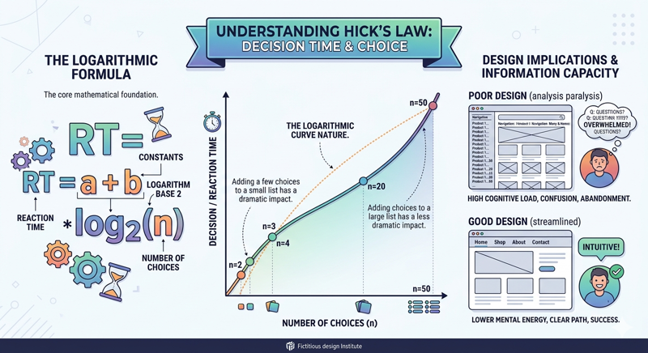
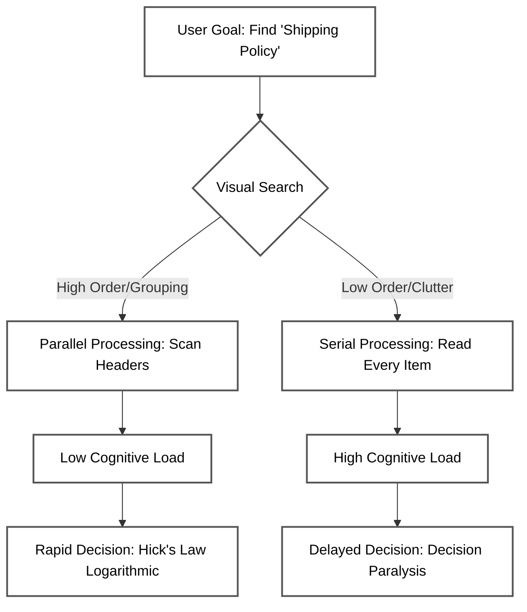

# Hicks Law and Decision Making

In the realm of Human-Computer Interaction (HCI), we often focus on making interfaces "intuitive" or "fast." However, speed isn't just about how quickly a server responds or how fast a user can move their mouse; it is also about how quickly a human mind can process information and arrive at a decision. This is where Hick’s Law (or the Hick-Hyman Law) becomes a vital tool for web designers. Named after psychologists William Edmund Hick and Ray Hyman, this law describes the time it takes for a person to make a decision as a result of the possible choices they have: increasing the number of choices will increase the decision time logarithmically.


> "The time it takes for a person to make a decision increases with the number of choices."
>
> William Hick - _source: samelogic.com [](https://samelogic.com/blog/hicks-law-a-timeless-guide-for-user-experience-design)_

Hick’s Law is the scientific foundation for the "less is more" philosophy. It provides a mathematical justification for simplifying interfaces, streamlining navigation, and reducing the cognitive burden placed on users. By understanding the relationship between choice and reaction time, you can move beyond aesthetic preferences and make design decisions rooted in human psychology.



[Experiment with Hick's Law](/course/ede2e6ad-1b55-4ddb-8d4b-e04beff16b9f/topic/3ad6ca22-a2f7-4308-97f2-1b3728ab056e)

### The Mathematical Foundation and Logic

The core of Hick’s Law is expressed through a logarithmic formula: `RT = a + b \log_2(n)`. In this equation, `RT` is the reaction time, `n` is the number of equally probable choices, and `a` and `b` are constants based on the context of the task. 

The most important takeaway for a designer is not the specific math, but the nature of the curve. Because the relationship is logarithmic rather than linear, the impact of adding choices is most dramatic when moving from a few options to several. For example, adding two more options to a menu of three has a much larger impact on decision time than adding two more options to a menu of fifty. 

This law is rooted in the concept of "information capacity." Our brains can only process a certain amount of information at once. When presented with a sprawling navigation menu or a cluttered homepage, the user must first identify all the options, evaluate their relevance, and then select the best path. Each additional choice consumes mental energy, leading to "analysis paralysis" where the user becomes overwhelmed and may abandon the site entirely.


```masteryls
{"id":"c82ceb6d-7b1a-485b-9c30-9ad22503a75d", "title":"The Intuition of Hick's Law", "type":"multiple-choice"}
Hick's Law describes the relationship between the number of choices available to a user and the time it takes them to make a decision. Which of the following best describes the underlying intuition for why this relationship is logarithmic rather than linear?

- [ ] Users must evaluate every single option individually and sequentially, meaning that doubling the number of choices will always double the total decision time.
- [x] Users tend to subdivide large sets of options into smaller categories or groups, narrowing their choice through a process of elimination similar to a binary search.
- [ ] Users experience a "choice paralysis" threshold where, after five options, the decision time stops increasing and remains constant regardless of further additions.
- [ ] Users make faster decisions as the number of options increases because the abundance of variety triggers an impulsive selection to avoid cognitive fatigue.
```


## Strategies for Simplifying Complex Navigation

In modern web development, we are often tasked with organizing vast amounts of content. While it is tempting to put everything "one click away" to ensure visibility, this often violates Hick’s Law and frustrates the user. To combat this, designers employ several strategies to manage complexity.

**Categorization and Chunking**
Rather than presenting forty individual links, successful designers group related items into distinct categories. This utilizes the concept of "chunking" from cognitive psychology. When a user sees five categories, they only have to make one high-level decision first. Once they select a category, they are presented with a smaller subset of choices. This hierarchical approach significantly reduces the initial cognitive load.

**Progressive Disclosure**
Progressive disclosure is the practice of showing only the information necessary for the user’s current task. A classic example is a multi-step checkout process. Instead of showing a single, massive form with thirty fields (shipping, billing, credit card, gift options), the designer breaks it into three or four distinct screens. By limiting the choices available at any single moment, the designer keeps the user focused and reduces the likelihood of error or abandonment.

**Curated Defaults and Recommendations**
Sometimes, the best way to help a user decide is to make the decision for them—or at least offer a starting point. Highlighting a "Most Popular" plan on a pricing page or providing a "Recommended" setting reduces the need for the user to evaluate every single variable. It provides a cognitive shortcut that allows them to bypass the logarithmic delay of Hick's Law.

## Practical Examples in Web Design

Consider the evolution of the "Mega Menu." Early web designs often featured massive dropdowns that covered half the screen with hundreds of links. Modern iterations of the mega menu use clear headings, iconography, and varying font weights to help the user's eye scan and categorize information quickly. By visually "weighting" certain options, designers help users ignore irrelevant choices, effectively reducing the value of `n` in the Hick’s Law equation.

Another example can be found in mobile app design. Due to limited screen real estate, mobile designers are forced to adhere to Hick’s Law. This is why many mobile apps use a "Hamburger" menu or a bottom tab bar with no more than five primary icons. These constraints actually improve the user experience by forcing the designer to prioritize the most essential actions, thereby speeding up user decision-making.

## Common Challenges and Stakeholder Management

One of the greatest challenges you will face as a designer is "feature creep" or pressure from stakeholders to include every possible option on the homepage. Marketing may want a newsletter signup, Sales may want a "Buy Now" button, and Product may want a link to the new feature—all in the same header.

When everyone wants their content to be prominent, the result is a cluttered interface where nothing is prominent. In these situations, Hick’s Law serves as your evidence. You can explain to stakeholders that by adding "just one more link," they are mathematically increasing the time it takes for a customer to find the "Purchase" button. Designing with Hick’s Law often requires making difficult choices about what *not* to include, prioritizing the user's mental ease over organizational politics.


## Cognitive Load and the Mechanics of Visual Search

Hick’s Law states that the time it takes for a person to make a decision is a result of the possible choices they have: increasing the number of choices will increase the decision time logarithmically. However, in the context of web design, this relationship is deeply influenced by **cognitive load**—the total amount of mental effort being used in the working memory—and the efficiency of **visual search**.

When a user is presented with a navigation menu, they do not simply count the items; they must perceive, categorize, and evaluate them. If the interface is cluttered or the items are poorly labeled, the "extraneous cognitive load" increases. This forces the user to switch from a fast, parallel processing mode (scanning for familiar keywords) to a slow, serial processing mode (reading every single item). This shift effectively breaks the logarithmic efficiency of Hick's Law, making the decision time increase linearly or even exponentially as the user becomes overwhelmed.

### The Interplay of Search and Decision
To understand how these concepts interact, consider the following flow of a user attempting to find a specific link in a dense navigation bar:



### Factors Influencing Visual Search Time
Several UI/UX factors determine whether a user experiences a "low load" or "high load" search:

*   **Categorical Grouping (Chunking):** Breaking 20 items into 4 distinct categories reduces the "n" in Hick's Law from 20 to 4 (initially), significantly lowering the initial mental processing requirement.
*   **Visual Saliency:** Using font weight, color, or icons to highlight primary actions helps the eye skip irrelevant data.
*   **Familiarity and Mental Models:** If a "Contact" link is in the top right (where users expect it), the visual search time is nearly zero, regardless of how many other links are present.

### Implementation Example: Simplifying Navigation
In the example below, we compare a "flat" navigation structure that maximizes cognitive load versus a "chunked" structure that optimizes visual search.

**Complex Navigation (High Cognitive Load):**
```html
<!-- Hard to scan: 8 items of equal weight -->
<nav>
  <a href="/shoes">Shoes</a>
  <a href="/shirts">Shirts</a>
  <a href="/returns">Returns</a>
  <a href="/pants">Pants</a>
  <a href="/support">Support</a>
  <a href="/hats">Hats</a>
  <a href="/tracking">Tracking</a>
  <a href="/jackets">Jackets</a>
</nav>
```

**Optimized Navigation (Low Cognitive Load):**
```html
<!-- Easy to scan: 2 clear categories (Shop vs. Help) -->
<nav>
  <div class="category">
    <h3>Shop</h3>
    <a href="/shoes">Shoes</a>
    <a href="/shirts">Shirts</a>
    <a href="/pants">Pants</a>
    <a href="/hats">Hats</a>
    <a href="/jackets">Jackets</a>
  </div>
  <div class="category">
    <h3>Help</h3>
    <a href="/returns">Returns</a>
    <a href="/support">Support</a>
    <a href="/tracking">Tracking</a>
  </div>
</nav>
```

By organizing the information, we allow the user's brain to "dismiss" entire sections of the screen that are not relevant to their current goal, keeping the cognitive load manageable and the decision time within the predictable bounds of Hick's Law.

```masteryls
{"id":"hicks-law-cog-load", "title":"Cognitive Load and Decision Time", "type":"multiple-choice"}
How does high cognitive load affect the application of Hick's Law in web navigation?

- [ ] It makes the decision time shorter because users stop caring about the options.
- [x] It increases decision time by forcing users to switch from efficient scanning to slow, serial processing of information.
- [ ] It has no effect, as Hick's Law is a mathematical constant that only depends on the number of items.
- [ ] It eliminates the need for visual search because the user becomes overwhelmed.
```


### When Hick’s Law Does Not Apply

It is important to recognize the limitations of this principle. Hick’s Law does not apply to "searching" in the way it applies to "deciding." For example, if a user is looking for their home state in an alphabetical dropdown list of 50 states, Hick’s Law is less relevant. Because the list is ordered predictably, the user isn't "deciding" between 50 options; they are scanning for a known variable.

Furthermore, Hick’s Law is less applicable to expert users who have developed "muscle memory" for a specific interface. For a professional video editor or a software developer using an IDE, having a hundred buttons available may be more efficient than hiding them behind menus, as the user has already internalized the location of those tools.

### Summary

Hick’s Law is a fundamental principle of HCI that reminds us that every additional choice carries a cognitive cost. To create effective, user-friendly websites, you must:
*   Minimize the number of options at any single point of decision-making.
*   Use categorization and chunking to make large amounts of data manageable.
*   Employ progressive disclosure to hide complexity until it is needed.
*   Prioritize essential tasks to prevent user overwhelm.

By respecting the human mind's processing limits, you create experiences that feel "fast" and "effortless," regardless of the underlying technical performance of the site.


```masteryls
{"id":"0cdfbe67-b088-4594-9ca8-1bbf92d2cf9e", "title":"Simplifying Navigation with Hick's Law", "type":"multiple-choice"}
Based on Hick's Law and principles of information architecture, which strategy is most effective for reducing a user's decision time when navigating a complex website?

- [ ] Presenting all possible navigation links on the homepage to minimize the total number of clicks required
- [x] Organizing links into clear categories and using progressive disclosure to hide secondary options
- [ ] Removing all descriptive labels and relying solely on high-resolution icons to save visual space
- [ ] Increasing the number of top-level menu items to ensure that no sub-menu contains more than two links
```


**Reflective Exercise:**
*Find a website you use frequently that feels "cluttered" or "confusing." Identify a specific section (like the navigation or a form) and count the number of choices presented to you at once. How could you apply progressive disclosure or categorization to reduce the decision time for a new user?*

**Further Reading:**
*   *The Paradox of Choice* by Barry Schwartz
*   *Laws of UX* by Jon Yablonski
*   *Universal Principles of Design* by William Lidwell, Kritina Holden, and Jill Butler