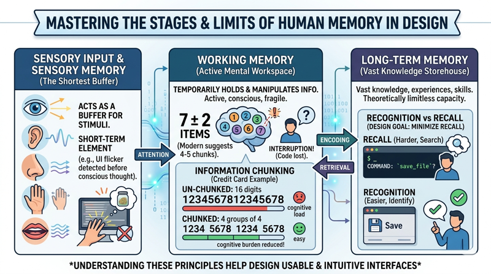
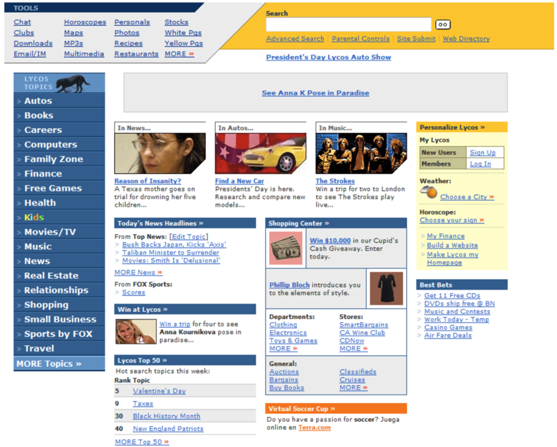
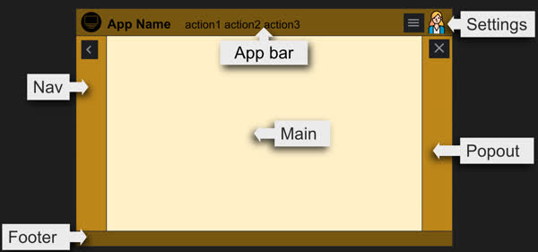

# Human Cognition and Memory

To design effective digital interfaces, we must first understand the "hardware" upon which our software runs: the human brain. Unlike a computer’s hard drive, human memory is volatile, associative, and strictly limited in capacity. When a user interacts with a website, they are not just moving a mouse; they are processing visual stimuli, maintaining goals in their mind, and retrieving past experiences to make sense of new layouts. 

In the field of Human-Computer Interaction (HCI), we view the user as an information-processing system. If a design exceeds the user's cognitive limits, the "system" crashes—leading to frustration, errors, and abandonment. This section explores the mechanics of short-term and long-term memory and provides actionable strategies for managing cognitive load in web design.

### The Stages of Memory

Human memory is generally categorized into three distinct stages: sensory memory, short-term (or working) memory, and long-term memory. 



Sensory memory is the shortest-term element of memory. It acts as a buffer for stimuli received through the five senses. In web design, this is why "flicker" or sudden changes in UI can be so jarring; our sensory memory detects the change before our conscious mind can even identify what happened. However, for the purpose of interaction design, our primary focus remains on the transition between working memory and long-term memory.

### Working Memory and the Limits of "The Magic Number"

Working memory is the mental workspace where we temporarily hold and manipulate information. It is active and conscious, but it is also incredibly fragile. If a user is interrupted while trying to remember a discount code to enter at checkout, that information is often lost almost instantly.

In 1956, cognitive psychologist George Miller published one of the most cited papers in psychology, suggesting that the number of objects an average human can hold in working memory is **7 ±2**. This is often referred to as "Miller’s Law." While modern research suggests that the number of "chunks" we can hold may actually be smaller (closer to 4 or 5) depending on the complexity of the information, the principle for web designers remains the same: _do not overwhelm the user's temporary storage_.

> "The number of objects an average human can hold in working memory is 7."
>
> _Miller's Law_

```masteryls
{"id":"a4b2a9f8-25e3-4ca4-8cca-42f3eb20537e", "title":"Miller's Law", "type":"web-page" "file":"demo/millers-law.html" "height":"750px"}

```

#### Practical Example: Information Chunking
Consider a credit card input field. A string of 16 digits (1234567812345678) is nearly impossible to hold in working memory at once. However, by "chunking" the data into four groups (1234 5678 1234 5678), we reduce the cognitive burden. The user no longer has to remember sixteen individual items; they only need to process four chunks.

### Long-Term Memory: Recognition vs. Recall

Long-term memory is our vast storehouse of knowledge, experiences, and skills. Unlike working memory, its capacity is theoretically limitless. However, the challenge lies in *retrieval*. 

In HCI, we distinguish between two types of retrieval: **recall** and **recognition**.
*   **Recall** requires the user to search their memory to find a specific piece of information (e.g., "What was the command to save a file in this terminal?").
*   **Recognition** requires the user to identify a piece of information that is presented to them (e.g., "I see a floppy disk icon; that must mean 'Save'.").

Recognition is significantly easier for the human brain than recall. This is why graphical user interfaces (GUIs) replaced command-line interfaces for the general public. As a designer, your goal should always be to minimize the need for recall. Users should not have to remember where a specific setting is located or what a specific term means from a previous page.


```masteryls
{"id":"ee1654ee-88f6-4e60-a111-4e9df0e1afb9", "title":"Recall vs. Recognition", "type":"multiple-choice"}
In the context of user interface design and cognitive load, which of the following best describes the difference between recall and recognition?

- [ ] Recall involves identifying a familiar item from a list of options, while recognition requires the user to generate information from memory without any visual cues.
- [x] Recognition relies on external cues to trigger memory, while recall requires the user to retrieve information from their long-term memory without assistance.
- [ ] Recall is a function of short-term memory used for temporary tasks, whereas recognition is the primary method for moving information into long-term memory.
- [ ] Recognition is more cognitively demanding than recall because the user must process multiple visual stimuli before making a decision.
```


### Understanding and Managing Cognitive Load

Cognitive load refers to the total amount of mental effort being used in the working memory. In the context of web design, we can break this down into three types based on John Sweller’s Cognitive Load Theory:

1.  **Intrinsic Load:** The inherent difficulty of the task itself (e.g., filing a complex tax return).
2.  **Extraneous Load:** The "bad" load created by the way information is presented (e.g., a cluttered layout, confusing navigation, or poor contrast).
3.  **Germane Load:** The "good" load that helps the user create mental models and learn (e.g., helpful tooltips or clear instructional steps).

Our primary responsibility as designers is to eliminate extraneous load so that the user can dedicate their limited mental resources to the task at hand (intrinsic load) and learning the system (germane load).

### Design Strategies for Limited Cognitive Load

To design for the human brain, we must adopt a "less is more" philosophy. Here are several practical strategies:

**Avoid Information Overload**
When a user lands on a page, they should be able to identify *the primary call to action* within seconds. If every element—banners, sidebars, pop-ups, and navigation—is competing for attention, the user's working memory becomes saturated, leading to "analysis paralysis."



> No primary call to action. _Source: Lycos.com_

**Use Progressive Disclosure**
Rather than showing every feature and option at once, use progressive disclosure. This involves showing only the information necessary for the current task and hiding advanced or secondary options behind "More" links or dropdown menus. This keeps the interface clean and prevents the user from being overwhelmed by choices.

**Leverage Existing Mental Models**
Users spend most of their time on *other* websites. This means they have already developed "mental models" for how a website works. If you place your search bar in the top right or your logo in the top left, you are leveraging their long-term memory. If you deviate from these conventions without a very good reason, you increase the cognitive load because the user must stop and think about how to use your specific site.



### Common Challenges and Solutions

**Challenge: The "Wall of Text"**
Large blocks of dense text are difficult to process. Users rarely read every word on a webpage; instead, they scan for keywords.
*   **Solution:** Use descriptive headings, bulleted lists, and bold text to highlight key information. This allows the user to process the information in small, manageable chunks.

**Challenge: Complex Multi-Step Processes**
Forms with twenty fields on a single page can feel insurmountable.
*   **Solution:** Break the process into a multi-step "wizard." Show a progress bar at the top. By showing only 3-4 fields at a time, you keep the user’s focus narrow and their cognitive load low.

### Summary

The human brain is a powerful but limited processor. By understanding that working memory is small and retrieval from long-term memory is difficult, we can design interfaces that feel intuitive and effortless. 

*   **Minimize the load:** Remove any element that doesn't help the user reach their goal.
*   **Chunk information:** Group related items together to make them easier to remember.
*   **Prioritize recognition:** Use icons, labels, and consistent patterns so users don't have to memorize your interface.
*   **Be predictable:** Follow established web conventions to tap into the user's existing knowledge.

By respecting the cognitive limits of your users, you create a more accessible, enjoyable, and successful digital experience.

***

**Further Reading and Resources**
*   *The Design of Everyday Things* by Don Norman (Focuses on mental models and human error).
*   *Don't Make Me Think* by Steve Krug (A classic on web usability and cognitive load).
*   *Miller, G. A. (1956).* "The Magical Number Seven, Plus or Minus Two: Some Limits on Our Capacity for Processing Information." Psychological Review.
*   *Nielsen Norman Group (NN/g):* Articles on "Short-Term Memory and Web Design."