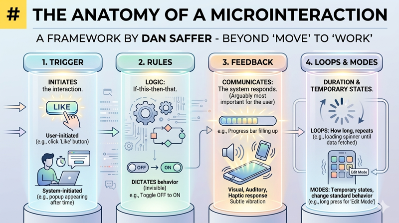

# Microinteractions and Animation

In the world of web design, we often focus on the "big" things: the navigation structure, the layout of the homepage, or the complexity of a checkout flow. However, what often separates a functional website from a truly professional and intuitive experience are the small, almost invisible moments of interaction. These are known as **microinteractions**. Whether it is the subtle change in a button's color when you hover over it, the satisfying "pop" of a notification bell, or the smooth sliding motion of a mobile menu, these details provide the "human" touch to digital interfaces.

Microinteractions are the functional details that serve a single task. While they may seem like mere "eye candy," they are deeply rooted in Human-Computer Interaction (HCI) principles. They bridge the gap between the user’s mental model and the system’s state, reducing cognitive load by providing immediate, visual confirmation of an action.

## The Anatomy of a Microinteraction

To design effective microinteractions, we look to the framework popularized by designer Dan Saffer. He identifies four essential components that make up every microinteraction. Understanding these helps designers move beyond "making things move" to "making things work."

The first component is the **Trigger**. This is what initiates the interaction. It can be user-initiated, such as clicking a "Like" button, or system-initiated, such as a popup appearing when a user has spent a certain amount of time on a page. 

The second component is **Rules**. These are the "if-this-then-that" logic of the interaction. If a user clicks a toggle, the rule determines that the state changes from "off" to "on." Rules are invisible to the user but dictate the behavior of the system.

The third component is **Feedback**. This is arguably the most important part for the user. Feedback is how the system communicates that the rules are being followed. It is the visual, auditory, or haptic response—like a progress bar filling up or a subtle vibration on a smartphone.

Finally, there are **Loops and Modes**. Loops determine how long the interaction lasts and if it repeats (like a loading spinner that loops until data is fetched). Modes are temporary states where the interaction changes the standard behavior of the interface, such as a "long press" on a mobile icon that enables an "edit mode."

## Reducing the Gulf of Evaluation

In HCI, Don Norman describes the "Gulf of Evaluation" as the distance between the system’s physical state and the user’s understanding of that state. When a user clicks a "Submit" button and nothing happens for three seconds, they enter a state of uncertainty. Did the click register? Is the internet slow? Should I click again?

Animation serves as the primary tool to bridge this gulf. By using a loading animation or a "success" checkmark, the designer provides immediate feedback. This confirms that the system has received the input and is processing it. Effective microinteractions ensure that the user is never left wondering about the status of their request, thereby increasing trust and reducing frustration.

## Functional Animation and the Principles of Motion

Animation in web design should never be arbitrary. It must be functional. When we talk about functional animation, we are referring to motion that explains logic, directs attention, or provides feedback.

One of the most important concepts in UI animation is **Easing**. In the physical world, objects do not start and stop instantaneously; they accelerate and decelerate. Linear motion (moving at a constant speed) feels robotic and unnatural to the human eye. By using "Ease-in" and "Ease-out" transitions, designers mimic real-world physics, making the interface feel more organic and less jarring.

**Timing and Duration** are equally critical. An animation that is too slow (over 500ms) can make an interface feel sluggish, while an animation that is too fast (under 100ms) might be missed entirely. The goal is to find the "Goldilocks zone"—typically between 200ms and 400ms—where the motion is noticeable but does not hinder the user’s task completion.

Consider the "Pull-to-Refresh" gesture popularized by Loren Brichter. It uses animation to show the user they are pulling against a "rubber band" (anticipation), provides a spinner (feedback), and then snaps back (completion). This sequence teaches the user how the feature works without a single word of instruction.

## Designing for Delight without Distraction

While microinteractions are functional, they also offer an opportunity for "delight." This is the emotional layer of design that makes an application feel polished and high-quality. A small animation on a "Success" state or a playful hover effect on a logo can create a positive brand association.

However, there is a fine line between delight and distraction. The primary rule of microinteractions is that they should be **subtle**. If a user notices the animation every single time they perform a common task, it might be too heavy. Over-animating an interface can lead to "UI fatigue," where the constant movement becomes annoying rather than helpful.

A good rule of thumb is: if the user doesn't consciously notice the microinteraction, but feels that the site is "smooth" or "responsive," you have succeeded. The interaction should support the task, not become the task itself.

## Accessibility and the "Precedence of Motion"

As we integrate animation, we must remain mindful of web accessibility standards, specifically the Web Content Accessibility Guidelines (WCAG). For some users, motion can cause physical discomfort, motion sickness, or even seizures.

The `prefers-reduced-motion` CSS media query is a vital tool for modern web designers. It allows you to detect if a user has enabled a setting on their operating system to minimize non-essential motion. When this is detected, your site should automatically disable or simplify animations.

Furthermore, any animation that lasts longer than five seconds or plays automatically must provide a way for the user to pause, stop, or hide it. Accessibility is not an afterthought; it is a fundamental requirement of responsible interaction design.

## Common Challenges and Solutions

Designing microinteractions comes with several practical challenges that require a balance of technical skill and design intuition.

**Performance Issues:** Complex animations can tax a device's CPU and GPU, leading to "jank" or stuttering. 
*Solution:* Stick to animating properties that browsers can handle efficiently, such as `transform` (scale, rotate, translate) and `opacity`. Avoid animating properties like `height`, `width`, or `margin`, as these trigger expensive layout recalculations.

**The "Uncanny Valley" of UI:** Sometimes an animation feels "off" because it doesn't match the brand or the context of the site.
*Solution:* Establish a "Motion Language" for your design system. Decide if your brand is energetic (fast, bouncy transitions) or professional (smooth, subtle fades). Consistency across all microinteractions builds a cohesive user experience.

**Over-Complexity:** It is easy to get carried away with modern CSS and JavaScript libraries.
*Solution:* Always ask, "Does this animation help the user understand what just happened?" If the answer is no, remove it.

## Summary

Microinteractions are the heartbeat of modern web design. They turn static layouts into living, breathing interfaces that communicate with the user. By following Dan Saffer’s framework of Triggers, Rules, Feedback, and Loops, designers can create purposeful moments that reduce the Gulf of Evaluation and guide users through complex tasks.

Remember that animation should be functional first and decorative second. By respecting physics through easing, adhering to accessible motion practices, and focusing on subtlety, you can create web experiences that are not only usable but truly delightful. As you continue your design journey, look for the small moments where a tiny animation could replace a line of text or provide that extra bit of clarity for your users.

***

### Recommended Resources for Further Exploration

*   **"Microinteractions: Designing with Details" by Dan Saffer:** The definitive text on the subject.
*   **The Nielsen Norman Group (NN/g):** Search for articles on "Feedback and Response Time" to understand the psychology of waiting.
*   **Material Design Motion Guidelines:** Google’s comprehensive guide on how motion should behave in a digital environment.
*   **MDN Web Docs - `prefers-reduced-motion`:** Technical documentation on implementing accessible motion.