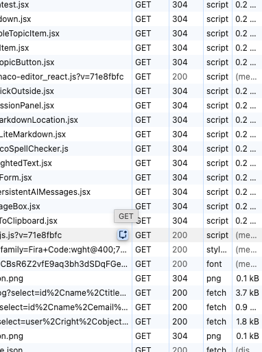

# Nielsens Ten Usability Heuristics

In the field of Human-Computer Interaction (HCI), we often look for universal truths that can guide us through the complex process of interface design. While every project has its unique constraints, certain "rules of thumb" have stood the test of time. These are known as heuristics. Developed by Jakob Nielsen in 1994, the Ten Usability Heuristics are perhaps the most cited and utilized framework for evaluating the usability of a user interface. 




> Jakob Nielsen (_source: [NN/Group](https://www.nngroup.com/articles/author/jakob-nielsen/)_)

Rather than being rigid laws, these heuristics serve as broad principles for interaction design. They are called "heuristics" because they are general rules of thumb and not specific usability guidelines. When you perform a heuristic evaluation—a process you will explore later in this module—you use these ten points as a checklist to identify where a design might be failing its users. For an undergraduate developer, mastering these principles is the difference between building a site that merely "works" and building one that provides a seamless, intuitive experience.

| Heuristic | Description |
| :--- | :--- |
| **1. Visibility of system status** | Keep users informed with timely feedback. |
| **2. Match to real world** | Use familiar language and concepts. |
| **3. User control & freedom** | Provide easy exits for mistakes. |
| **4. Consistency & standards** | Follow conventions and stay consistent. |
| **5. Error prevention** | Prevent issues before they occur. |
| **6. Recognition over recall** | Make options visible, not memorable. |
| **7. Flexibility & efficiency** | Support both novice and expert users. |
| **8. Aesthetic & minimalist design** | Remove unnecessary elements. |
| **9. Error recovery** | Provide helpful, clear error messages. |
| **10. Help & documentation** | Offer accessible, task-focused help. |

## 1. Visibility of System Status

> [!TIP]
>
> Keep the user informed

The first heuristic dictates that the system should always keep users informed about what is going on, through appropriate feedback within a reasonable time. When a user interacts with a system, they need to know that their action was registered. Without feedback, users feel anxious and may repeat actions unnecessarily, such as clicking a "Submit" button multiple times because they aren't sure if the first click worked.

A classic example is the progress bar. When downloading a large file or uploading an image, a progress bar tells the user that the system is working and how much longer they need to wait. In web development, this might also look like a "loading" spinner or a change in button color once it has been pressed. The goal is to eliminate uncertainty.

## 2. Match Between System and the Real World

> [!TIP]
>
> Leverage real world experience

The system should speak the users' language, using words, phrases, and concepts familiar to the user, rather than system-oriented terms. This principle relies heavily on the concept of mental models—the internal map a user has of how something should work based on their real-world experience.

For instance, the "trash" or "recycle bin" icon on a desktop is a direct metaphor for a physical object. In web design, avoid using technical jargon like "Error 404: Null Pointer Exception" in user-facing messages. Instead, use natural language like "We can't find the page you're looking for". By following real-world conventions, you make the interface feel intuitive and reduce the cognitive load on the user.

## 3. User Control and Freedom

> [!TIP]
>
> Taking away user control diminishes trust

Users often perform actions by mistake and need a clearly marked "emergency exit" to leave the unwanted state without having to go through an extended dialogue. This heuristic is about giving power back to the user. When a user feels trapped by an interface, their trust in the system diminishes.

The most common implementation of this is the "Undo" and "Redo" functionality. In web forms, this might be a "Cancel" button that returns the user to the previous page without saving changes. If a user accidentally deletes an email, a simple "Undo" toast notification provides the freedom to fix the mistake immediately.

## 4. Consistency and Standards

> [!TIP]
>
> Deviating from standards leads to confusion not innovation

Users should not have to wonder whether different words, situations, or actions mean the same thing. This is often referred to as Jakob’s Law: "Users spend most of their time on other sites." This means they expect your site to work similarly to all the other sites they already know.

Consistency comes in two forms: internal and external. Internal consistency means that if you use a blue button for "Save" on one page, you shouldn't use a green button for "Save" on another. External consistency means following industry standards. For example, most users expect the company logo in the top-left corner to take them back to the homepage. Deviating from these standards usually leads to confusion rather than innovation.

## 5. Error Prevention

> [!TIP]
>
> Better to prevent rather than repair

Even better than good error messages is a careful design which prevents a problem from occurring in the first place. We categorize errors into two types: slips and mistakes. Slips occur when a user intends to do one thing but does another (like a typo). Mistakes occur when the user has a wrong mental model of how the system works.

Practical examples of error prevention include:
*   Disabling a "Submit" button until all required fields are filled.
*   Using a date picker instead of a text field to prevent formatting errors.
*   Providing a confirmation dialog before a permanent action, like "Are you sure you want to delete this folder?"

## 6. Recognition Rather Than Recall

> [!TIP]
>
> Prime the user's memory

The user should not have to remember information from one part of the interface to another. Human short-term memory is limited. Minimize the user's memory load by making objects, actions, and options visible. 

A great example of this is the "Recently Viewed" section on e-commerce sites. Instead of forcing the user to remember the exact name of a product they looked at ten minutes ago, the system recognizes their history and displays it. Similarly, search bars that provide "auto-suggestions" help users recognize the term they are looking for rather than forcing them to recall the exact spelling.

## 7. Flexibility and Efficiency of Use

> [!TIP]
>
> Facilitate diversity of use

Design should cater to both inexperienced and experienced users. While a novice needs step-by-step guidance, an expert user wants "accelerators"—features that speed up the interaction for the power user.

Think about keyboard shortcuts (like Ctrl+C and Ctrl+V). They are invisible to the novice but provide immense efficiency for the expert. In web applications, this might include the ability to skip tutorials, use advanced search filters, or customize a dashboard layout. Your design should be simple enough for a first-time visitor but powerful enough for a daily user.

## 8. Aesthetic and Minimalist Design

> [!TIP]
>
> Simple is better

Interfaces should not contain information that is irrelevant or rarely needed. Every extra unit of information in an interface competes with the relevant units of information and diminishes their relative visibility. This is often called the "signal-to-noise ratio."

Modern web design favors whitespace and "flat" design to keep the focus on the content. A common mistake in web development is trying to cram too much information "above the fold." Instead, prioritize the most important tasks and hide secondary information behind menus or "read more" links. Remember: less is often more.

## 9. Help Users Recognize, Diagnose, and Recover from Errors

> [!TIP]
>
> Make errors actionable

When errors do occur, the messages should be expressed in plain language (no codes), precisely indicate the problem, and constructively suggest a solution. 

A bad error message says: "Invalid Input." 
A good error message says: "Your password must include at least one capital letter and one number." 

By providing a path to recovery, you prevent the user from feeling stuck or frustrated. Visual cues, like highlighting the specific form field that caused the error in red, also help the user diagnose the problem quickly.

## 10. Help and Documentation

> [!TIP]
>
> Provide increasing layers of help

Ideally, a system should be so easy to use that it doesn't need documentation. However, it may be necessary to provide help that is easy to search, focused on the user's task, and lists concrete steps to be carried out.

Documentation should not be a massive manual. Instead, consider "contextual help," such as tooltips that appear when hovering over a complex icon, or a searchable FAQ section. For complex web applications, a short "onboarding" tour can be an effective way to provide help right when the user starts.


| Layer | Description |
|----------|----------|
| Orientation | Optional onborading tour |
| Convention | Follows expected standards |
| Inplace | Tooltip with description |
| Feedback | In context messages |
| External Documentation | Tutorials and instructions |
| AI | Context sensitive feedback and discussion |
| Community | User or product question forums |
| Live support | Interactive live representatives |


## Challenges in Applying Heuristics

While these ten principles are powerful, they are not without challenges. One common difficulty is **Heuristic Clashes**. For example, adding more "Help and Documentation" (Heuristic 10) might clutter the interface, violating "Aesthetic and Minimalist Design" (Heuristic 8). The role of the designer is to find the right balance based on the specific needs of the user.

Another challenge is **Subjectivity**. What one designer considers "minimalist," another might consider "empty." To solve this, always pair heuristic evaluations with actual user testing. Heuristics help you find the "low-hanging fruit" of usability issues, but they cannot replace the insights gained from watching a real human interact with your product.

## Summary

Nielsen’s Ten Usability Heuristics provide a foundational framework for creating user-centered designs. By focusing on visibility, consistency, and error prevention, you can create web interfaces that feel natural and efficient. As you move forward into conducting your own heuristic evaluations and planning usability tests, keep these principles at the forefront of your mind. They are the lens through which you should view every button, menu, and form you develop.


```masteryls
{"id":"9435a938-a8a5-4cce-a9c5-ca5a9567fe29", "title":"Nielsen's Heuristics", "type":"essay" }
Look at your favorite social media platform or web application. Can you identify one instance where they successfully follow a heuristic and one instance where they might be violating one? How does that violation affect your experience as a user?
```


### External Resources
*   [NN/g: 10 Usability Heuristics for User Interface Design](https://www.nngroup.com/articles/ten-usability-heuristics/) – The original source and detailed articles for each heuristic.
*   [LawsofUX.com](https://lawsofux.com/) – A visual guide to many of the psychological principles that overlap with these heuristics.