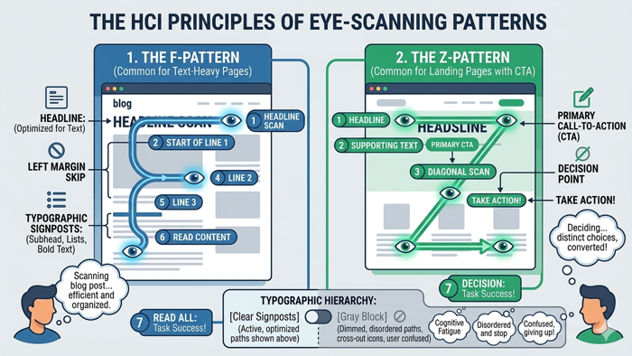
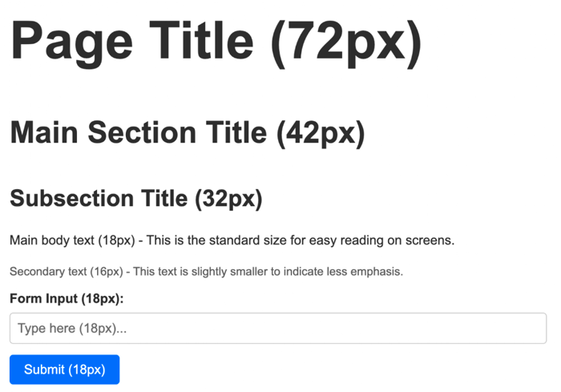
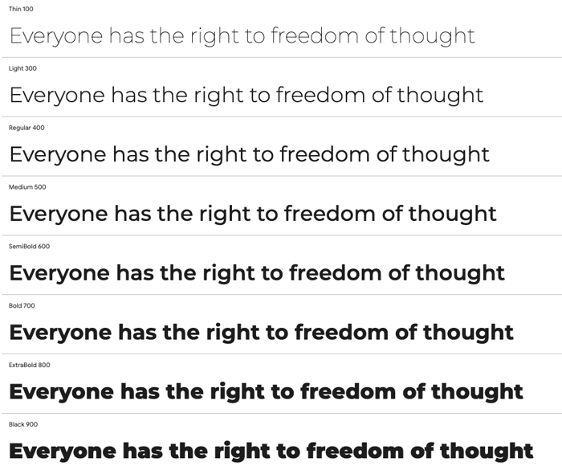

# Visual Hierarchy and Typography

In the realm of web design, typography is far more than a choice of fonts; it is the primary vehicle for communication and the foundational structure of the user interface. Because the majority of web content is text-based, the way we arrange and style that text determines how easily a user can process information. Visual hierarchy is the strategic arrangement of elements to imply importance, guiding the user’s eye through a layout in a specific order. By mastering the interplay of scale, weight, and color, designers can transform a wall of text into a navigable, intuitive experience that respects the user's cognitive load and mental models.

### The Psychology of Scanning

Before diving into specific typographic attributes, it is essential to understand how users interact with digital screens. As usability expert Jakob Nielsen famously noted, users rarely read web pages word-for-word; instead, they scan. They look for "hooks"—headings, bold words, and bullet points—that allow them to quickly assess whether the content is relevant to their goals.

Effective typography leverages known scanning patterns, such as the **F-Pattern** (common for text-heavy pages like blogs) and the **Z-Pattern** (common for landing pages with distinct calls to action). By creating a clear visual hierarchy, you provide the "signposts" that help users navigate these patterns efficiently. Without this structure, a page becomes a "gray block," leading to cognitive fatigue and high bounce rates.

### Scale and the Modular Scale

Scale is perhaps the most immediate tool for establishing hierarchy. Larger elements naturally attract more attention than smaller ones. However, effective scale is not about making things "big" at random; it is about creating a mathematical relationship between different levels of information.

In professional web design, we often use a **Modular Scale**. This is a sequence of numbers that relates to one another through a specific ratio (such as the Golden Ratio or a Major Third). For example, if your base body text is 16px and you use a ratio of 1.25, your headings would follow a predictable progression: 20px, 25px, 31px, and so on.

| Typographic Element | Standard Size (px) | Application of Scale, Weight, and Color |
| :--- | :--- | :--- |
| **Title** | 72px | Utilizes maximum **scale** and heavy **weight** to establish the primary visual anchor on a page. |
| **Heading** | 42px-18px | Uses increased **scale** relative to body text to organize content and guide the eye during scanning. |
| **Paragraph** | 18px-16px | The baseline for legibility; typically uses a neutral **color** (e.g., dark gray) to reduce eye strain during extended reading. |
| **Label** | 18px | Uses a smaller **scale** but often a distinct **weight** (Bold) or **color** to signify its role as secondary metadata. |
| **Input Element** | 18px | Sized to ensure accessibility; maintains consistent **scale** with paragraph text to provide a seamless interactive experience. |
| **Button** | 18px | Matching paragraph text with padding signifiers. |

Using a consistent scale ensures that the difference between an H1 (the primary page title) and an H2 (a section subhead) is distinct enough for the user to perceive the change in "level" instantly. A common mistake is making headings too similar in size to the body text, which flattens the hierarchy and confuses the structural relationship of the content.

> 

### The Power of Typographic Weight

Weight refers to the thickness of the character strokes. Most web fonts come in a variety of weights, typically ranging from Thin (100) to Black (900). Weight is a powerful tool for creating emphasis without changing the layout's footprint.

A bold heading (e.g., 700 weight) paired with a regular weight body (400) creates a "pop" that allows the heading to stand out even if the size difference is minimal. This is particularly useful in dense interfaces, such as data dashboards or mobile applications, where screen real estate is limited. 

When applying weight, designers must be cautious of "faux bolding"—a browser-generated thickening of a font that occurs when the specific bold weight of a typeface hasn't been loaded. This results in blurry, illegible text. Always ensure your CSS `@font-face` declarations include the specific weights you intend to use.

### Color, Contrast, and Semantic Meaning

Color in typography serves two purposes: aesthetic appeal and functional guidance. By manipulating the contrast between the text and the background, you can pull a user’s attention toward a Call to Action (CTA) or push less important information (like a footer or a timestamp) into the background.

High contrast (black text on a white background) is the standard for readability. However, designers often use "de-emphasized" colors, such as a medium gray, for secondary information. This tells the user: "Read this if you need more detail, but it isn't the main point."

From an HCI perspective, color must be used with accessibility in mind. The **Web Content Accessibility Guidelines (WCAG)** require specific contrast ratios (usually 4.5:1 for body text) to ensure content is readable by users with visual impairments. Furthermore, color should never be the *only* way to convey meaning. For example, a link should have an underline or a weight change in addition to a color change, ensuring that color-blind users can still identify interactive elements.

### Practical Application: Building a Hero Section

Consider a standard "Hero" section on a homepage. To guide the eye effectively, a designer might apply the following hierarchy:

1.  **The Headline (H1):** The largest text on the page, set in a bold weight (700) and a high-contrast color. This is the first thing the user sees.
2.  **The Subheadline:** Significantly smaller than the headline (perhaps 50% of the size) and set in a medium weight (400 or 500). It provides context to the headline.
3.  **The Call to Action (CTA):** While the text inside the button might be small, the button itself uses a high-contrast background color to grab attention, often rivaling the H1 for the user's initial focus.
4.  **The Eyebrow Text:** A small, all-caps label sitting above the H1. By using a smaller scale but a different casing or letter-spacing, it provides categorization without distracting from the main message.

### Common Challenges and Solutions

A frequent challenge in web design is the "Everything is Important" syndrome. When a client or stakeholder wants every feature to stand out, the result is a cluttered interface where nothing stands out. 

**The Solution:** Use the "Squint Test." Close your eyes halfway until the text on your screen becomes blurry. What elements still stand out? If you see one or two clear shapes, your hierarchy is working. If you see a chaotic jumble of competing blocks, you need to increase the variance in scale and weight.

Another challenge is maintaining hierarchy across responsive breakpoints. A font size that looks majestic on a 27-inch monitor may be overwhelming on a smartphone. 

**The Solution:** Implement fluid typography using CSS functions like `clamp()`. This allows font sizes to scale smoothly between a defined minimum and maximum, ensuring that your visual hierarchy remains intact regardless of the device.

### Summary

Visual hierarchy in typography is the art of prioritizing information. By thoughtfully applying scale, designers establish the "order of operations" for the user's eyes. By utilizing weight, they create structural emphasis and variety. Through the strategic use of color and contrast, they ensure both accessibility and focus. Together, these elements form a cohesive system that respects the user’s time and cognitive energy, turning a simple webpage into a functional tool for communication.

For further exploration of these principles, students are encouraged to review *The Elements of Typographic Style* by Robert Bringhurst for classical foundations, and Ellen Lupton’s *Thinking with Type* for a modern, web-centric perspective on layout and grid systems.