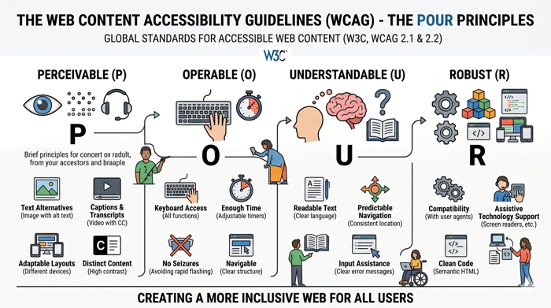

# Web Accessibility and WCAG

The power of the web is in its universality. As Sir Tim Berners-Lee, the inventor of the World Wide Web, famously stated, "Access by everyone regardless of disability is an essential aspect." Web accessibility, often abbreviated as **A11y**, is the practice of ensuring there are no barriers that prevent interaction with, or access to, websites by people with physical disabilities, situational disabilities, or socio-economic restrictions on bandwidth and speed. When sites are correctly designed, developed, and edited, all users have equal access to information and functionality.

You will find that when you create universal designs, all users usually benefit. This is usually a by product of intentional thought for the minority that unintentionally solves problems that the majority didn't know were also impacting them.

In the context of Human-Computer Interaction (HCI), accessibility is not a "bolt-on" feature to be considered at the end of a project. Instead, it is a core component of usability. A site that is inaccessible is, by definition, unusable for a significant portion of the population. This lesson explores the standards that govern the web and provides practical strategies for designing inclusive digital experiences.

## The Web Content Accessibility Guidelines (WCAG)

To create a shared standard for web accessibility, the World Wide Web Consortium (W3C) developed the Web Content Accessibility Guidelines, known as WCAG. Currently, WCAG 2.1 and 2.2 are the most widely accepted standards globally. These guidelines are organized under four fundamental principles, often referred to by the acronym **POUR**.



### Perceivable
Information and user interface components must be presentable to users in ways they can perceive. This means users must be able to comprehend the information being depicted; it cannot be invisible to all of their senses. For example, providing text alternatives for non-text content allows that content to be converted into other forms people need, such as large print, braille, speech, symbols, or simpler language.

### Operable
User interface components and navigation must be operable. The interface cannot require interaction that a user cannot perform. A primary example is ensuring that all functionality is available from a keyboard, as many users with motor impairments cannot use a mouse. Operability also includes giving users enough time to read and use content and avoiding design patterns known to cause seizures (such as rapid flashing).

### Understandable
Information and the operation of the user interface must be understandable. Users must be able to understand the information as well as the operation of the interface. This involves making text readable and predictable. For instance, navigation menus should appear in the same place across different pages, and error messages should provide clear instructions on how to fix a problem.

### Robust
Content must be robust enough that it can be interpreted reliably by a wide variety of user agents, including assistive technologies. As technologies and user agents evolve, the content should remain accessible. This is largely achieved by following clean, semantic HTML standards so that screen readers and other tools can accurately parse the code.

## Designing for Visual Impairments

Visual impairments range from total blindness and low vision to color blindness. Designing for these users requires a departure from a "visual-only" mindset.

One of the most critical tools for blind users is the **Screen Reader** (such as JAWS, NVDA, or VoiceOver). Screen readers announce the content of a webpage linearly. To support this, designers must ensure a logical visual hierarchy that translates to a logical document object model (DOM) order. Use semantic HTML tags like `<header>`, `<nav>`, `<main>`, and `<footer>` rather than generic `<div>` containers. This allows screen reader users to jump between sections of a page quickly.

For images, "Alt Text" (alternative text) is mandatory. An image of a "Submit" button should have alt text that says "Submit," while a decorative background image should have an empty alt attribute (`alt=""`) so the screen reader knows to skip it.

For users with low vision or color blindness, contrast is king. WCAG AA standards require a contrast ratio of at least 4.5:1 for normal text and 3:1 for large text. Furthermore, never use color as the *only* visual means of conveying information. For example, an error message should not just be red text; it should also include an icon or an explicit text label like "Error:" to ensure users who cannot perceive red can still understand the state of the system.


```masteryls
{"id":"26ab1e89-ede7-4359-8885-b3cb90f87f2f", "title":"Visual impairments", "type":"essay" }
What should you consider when designing for visual impairments?
```


## Designing for Motor and Physical Impairments

Motor impairments can include persistent conditions like Parkinson’s disease or temporary situations like a broken arm. These users often rely on keyboards, switch devices, or mouth sticks instead of a mouse.

The "Keyboard-First" rule is essential here. Can you navigate your entire website using only the `Tab` key? Every interactive element—links, buttons, form fields—must have a visible **focus state**. Often, designers remove the default blue glow provided by browsers because they find it "ugly," but for a keyboard user, removing that indicator is like taking the cursor away from a mouse user.

Additionally, consider **Fitts's Law**, which states that the time to acquire a target is a function of the distance to and size of the target. For users with limited fine motor control, small buttons placed close together are nearly impossible to use. Ensure that "click targets" or "tap targets" are large enough (at least 44x44 pixels) and have sufficient spacing to prevent accidental clicks.

## Designing for Auditory and Cognitive Impairments

Accessibility also encompasses how we process sound and information. For users who are deaf or hard of hearing, any audio content must have a text-based alternative. This includes synchronized captions for video and transcripts for podcasts. Beyond legal compliance, transcripts improve SEO and allow users in loud environments (or quiet libraries without headphones) to consume your content.

Cognitive accessibility is perhaps the most diverse category, covering ADHD, dyslexia, autism, and memory impairments. The guiding principle here is **consistency and simplicity**.
- Use plain language and avoid jargon.
- Maintain a consistent layout so users don't have to "re-learn" your site on every page.
- Avoid moving or flickering content that can be distracting or overstimulating.
- Provide clear feedback for actions. If a form submission fails, highlight exactly where the error occurred and why.

## Common Challenges and Solutions

A frequent challenge in modern web design is the use of **Single Page Applications (SPAs)** and dynamic content. When a page updates without a full refresh, a screen reader may not realize the content has changed. 
*   **Solution:** Use **ARIA (Accessible Rich Internet Applications) Live Regions**. By marking a container as `aria-live="polite"`, you tell the screen reader to announce any changes within that container to the user without interrupting their current task.

Another challenge is the "Accessibility Overlay" or "Automated Plugin" trap. Many companies sell scripts that claim to fix all accessibility issues automatically. 
*   **Solution:** Avoid these. True accessibility requires intentional design and semantic code. Overlays often interfere with the user's own assistive technology and fail to fix fundamental issues like poor heading structures or confusing navigation logic.

## Thoughtful Engagement: The "No-Mouse" Challenge

To truly understand the importance of accessibility, try this exercise: Disconnect your mouse or disable your trackpad for thirty minutes. Attempt to complete a common task online—such as ordering a pizza or checking your bank balance—using only your keyboard (`Tab`, `Shift+Tab`, `Enter`, and `Spacebar`). 

As you navigate, ask yourself:
- Do I always know where the "focus" is?
- Are there "keyboard traps" where I get stuck in a menu and can't get out?
- Does the order of navigation make sense, or am I jumping randomly across the screen?

This shift in perspective is often more educational than reading any technical specification.

## Summary

Web accessibility is a fundamental requirement of professional web design, rooted in the principles of the WCAG: Perceivable, Operable, Understandable, and Robust. By designing for users with visual, motor, auditory, and cognitive impairments, we create a more resilient and usable web for everyone. Key practices include using semantic HTML, ensuring high color contrast, providing keyboard-accessible interfaces, and offering text alternatives for multimedia. Remember, accessibility is not a checklist to be completed at the end of a project; it is a mindset that informs every design decision from the first wireframe to the final line of code.

### External Resources for Further Learning
- [W3C Web Accessibility Initiative (WAI)](https://www.w3.org/WAI/): The official source for WCAG standards and tutorials.
- [The A11y Project](https://www.a11yproject.com/): A community-driven resource for making digital accessibility easier.
- [WebAIM (Accessibility in Mind)](https://webaim.org/): Excellent tools for contrast checking and technical articles on implementation.